# Usando una Raspberry Pi400

## Configuración inicia


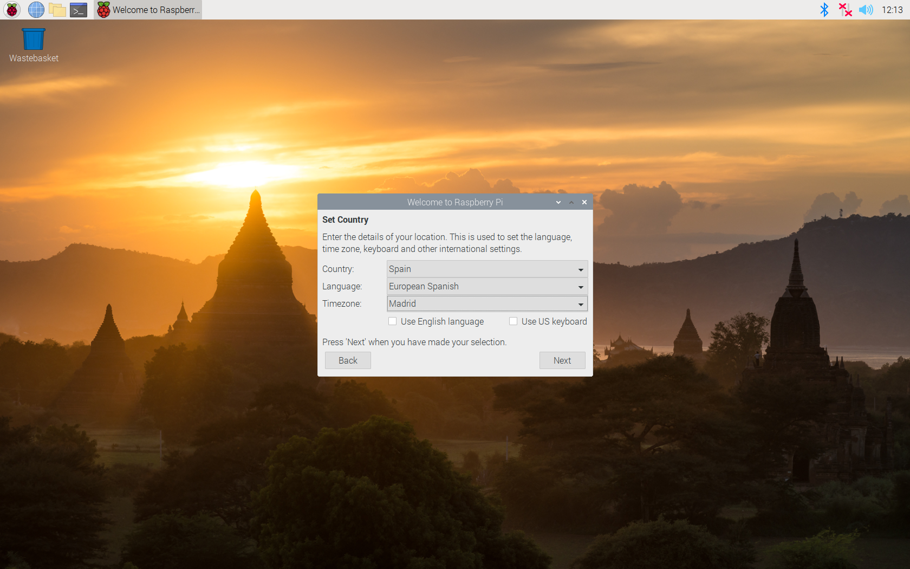
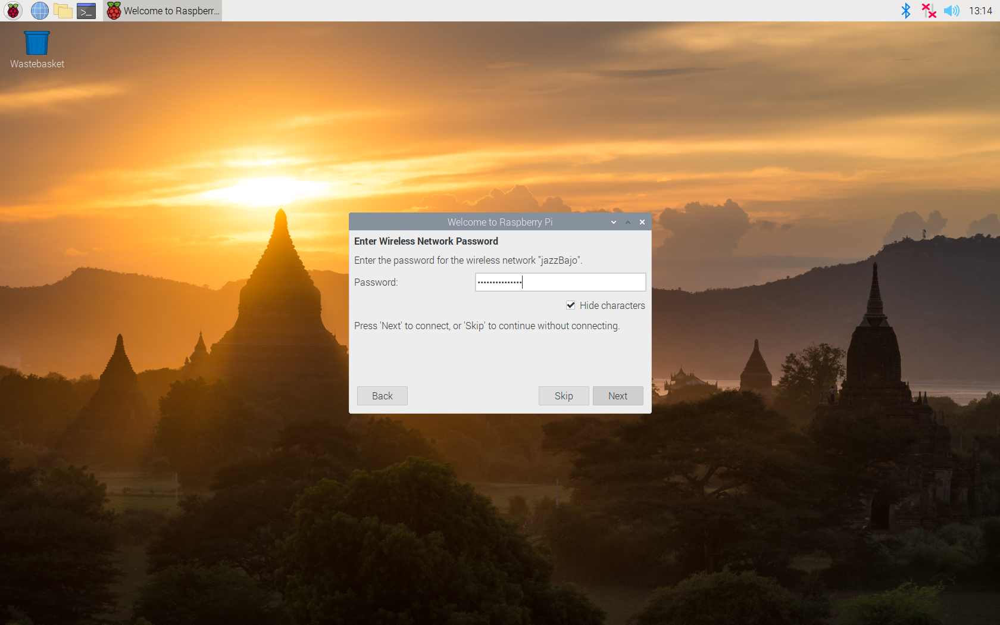


Configuramos el idioma y el teclado
Configuramos el wifi

Actualizamos el sistema con

```sh
sudo apt update
sudo apt full-upgrade
```

## ¿32 o 64 bits?

Ejecutamos 

```sh
uname -m
```
si nos sale aarch64 es de 64 bits, si nos dice armv7l es de 32 bits


## Capturado pantalla
Pulsamos el botón PrtScn
El programa se llama scrot  podemos ejecutarlo y se guardará una captura en el directorio del usuario


## Prueba de funciionamiento


### Tinkercad


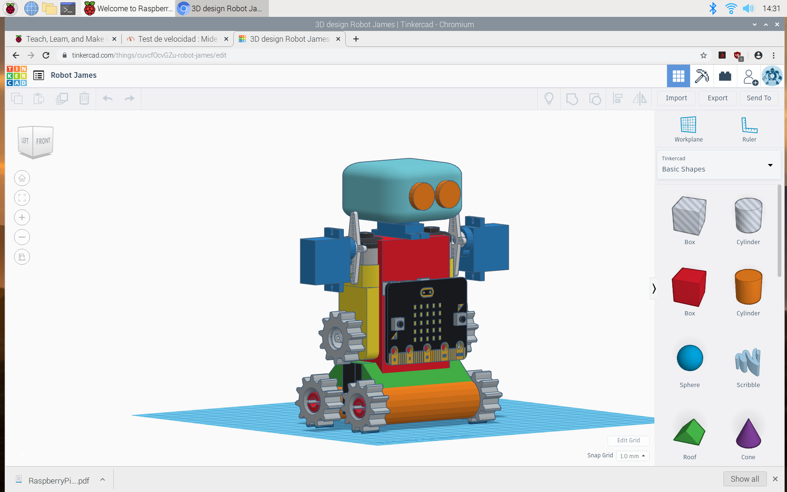
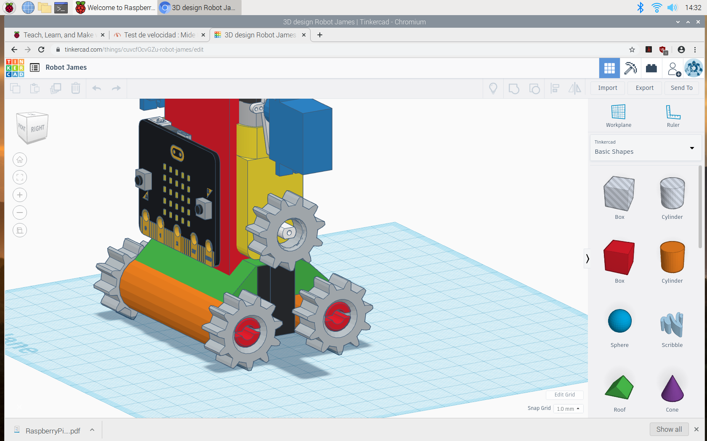
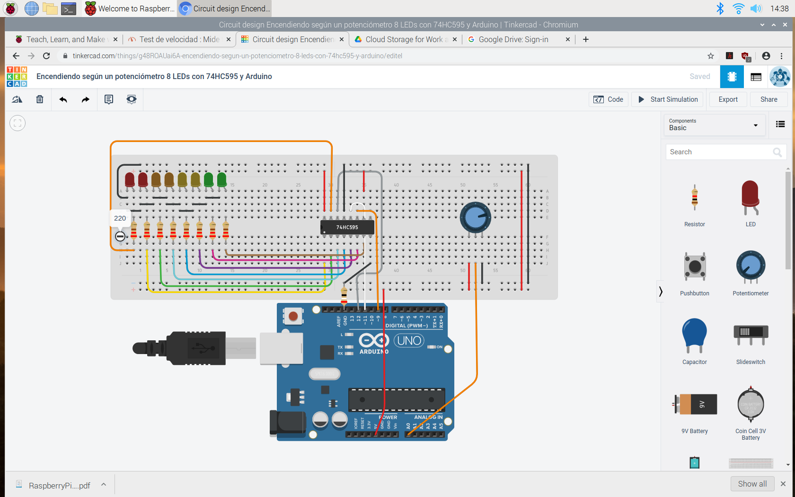

### Youtube

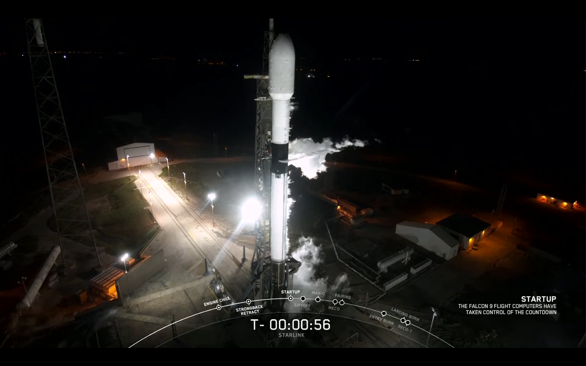
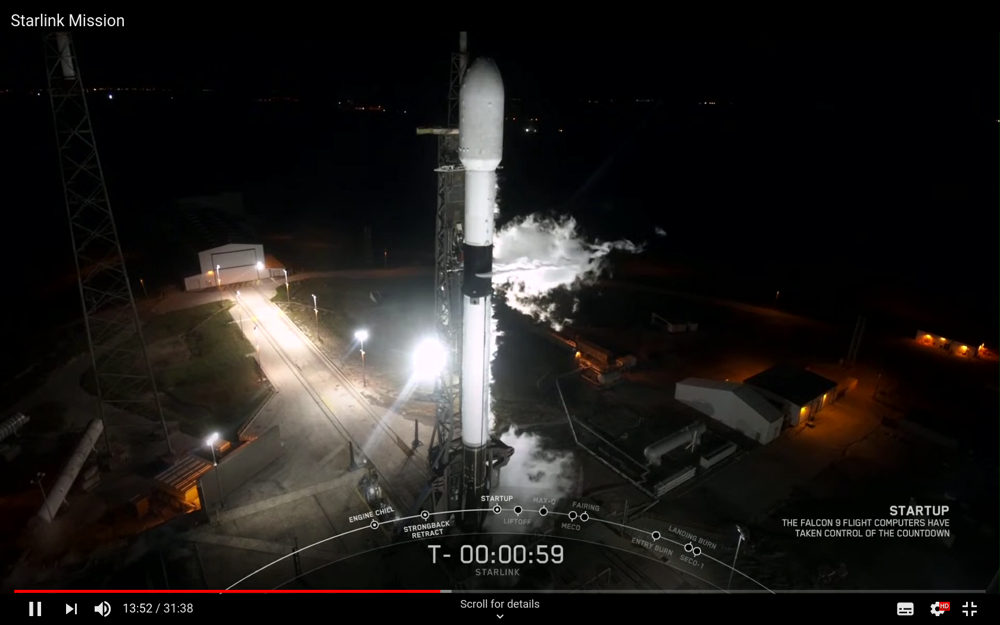


## Github

Para hacer más sencillo mi trabajo configuramos la conexión con Github para poder sincronizar los repositorios

Generamos una clave ssh con 

```sh
ssh-keygen -t ed25519 -C "your_email@example.com"
```


Ahora ejecutamos el agente ssh

```sh
eval "$(ssh-agent -s)"
```

y ahora añadimos la clave

```sh
ssh-add ~/.ssh/id_ed25519
```


Para ello añadiremos la ssh key a **https://github.com/settings/keys con**

```sh
sudo apt-get install xclip

xclip -selection clipboard < ~/.ssh/id_ed25519.pub
```

## Edición de audio


```sh
sudo apt install audacity
```

Mejora el funcionamiento al instalar pulseaudio con
```sh
sudo apt install pulseaudio
```


## Capturar video/screencast

3 alternativas

Cuidado con el espacio en disco, ya normalmente por las limitación de capacidad de procesamiento se guardarn los vídeos sin comprimir y ocupan mucho

## RecordMyDesktop

Lo instalamos

```sh
sudo apt-get install gtk-recordmydesktop

```

[Fuente](https://raspberrypi.stackexchange.com/questions/108274/is-it-possible-to-record-the-screen-and-audio-on-a-raspberry-pi-4-model-b)


En mi caso da un error en la codificación del color


### Kazam

```sh
sudo apt-get install kazam
```

Funciona bien salvo por el problema de que no guardar la configuración del directorio donde se guarda el video
Incluso si ponemos otro lo guarda en ~/Videos

### SimpleDesktopRecorder

Funciona muy bien

```sh
sudo apt install simplescreenrecorder 
```

## Edición de vídeo

```sh
sudo apt install openshot
```

## Arduino

Descargado desde arduino.cc


## microblocks

Entorno de programación de muchos microcontroladores (micro:bit, esp32, m5stack, ...) con bloques


##  Visual Studio

Descargamos desde https://code.visualstudio.com/ 
Version arm


https://code.visualstudio.com/docs/?dv=linuxarmhf_deb

¿extensiones?
* Git
* Arduino
* esp32
* markdown
* pdf

## Diseño 3d

Blender 

¿Cómo se ha instalado?

## Freecad

Instalamos directamente


```sh
sudo apt install freecad
```
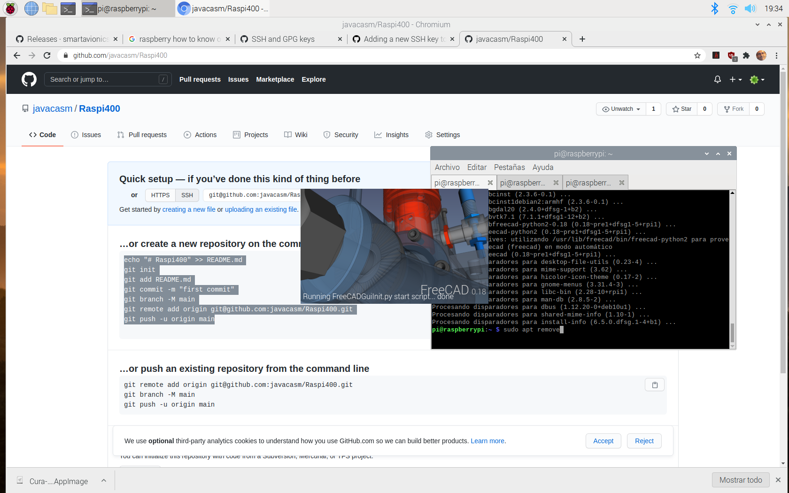


Error

Coin warning in cc_glglue_instance(): Error when setting up the GL context. This can happen if there is no current context, or if the context has been set up incorrectly.
Program received signal SIGSEGV, Segmentation fault.
#0  /lib/arm-linux-gnueabihf/libc.so.6(__default_sa_restorer+0) [0xb33e3120]


## Ultimaker Cura

Podemos instalar el software Cura, versión 3.3.1 desde el sistema normal con

```sh
sudo apt install cura
```

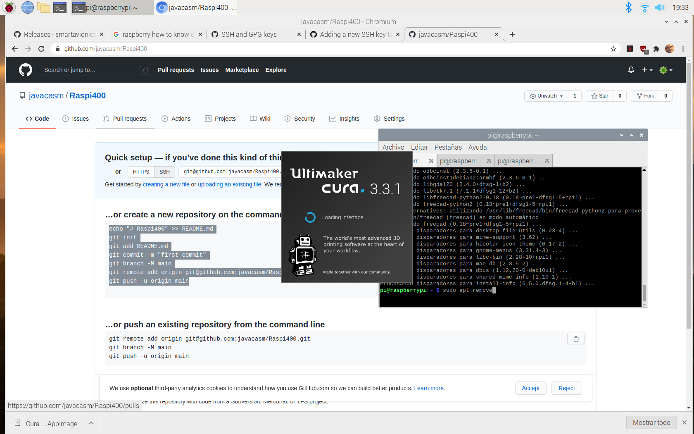

Pero da error al ejecutarse

Una alternativa es descargar una versión en formato appimage creada a partir del código fuente desde [este repositorio](https://github.com/smartavionics/Cura/releases)


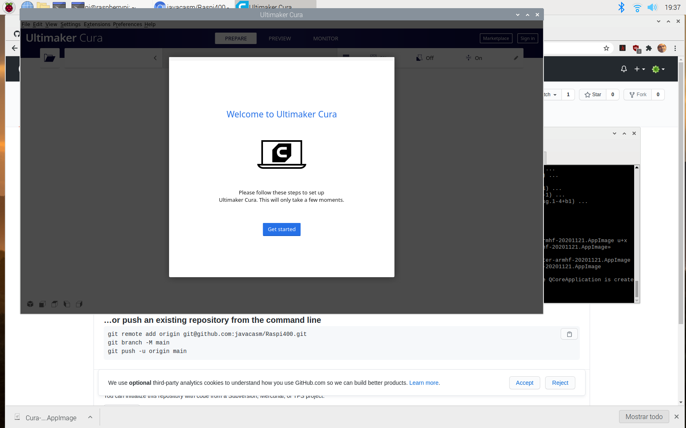

Descargamos un modelo STL de thingiverse para probarlo

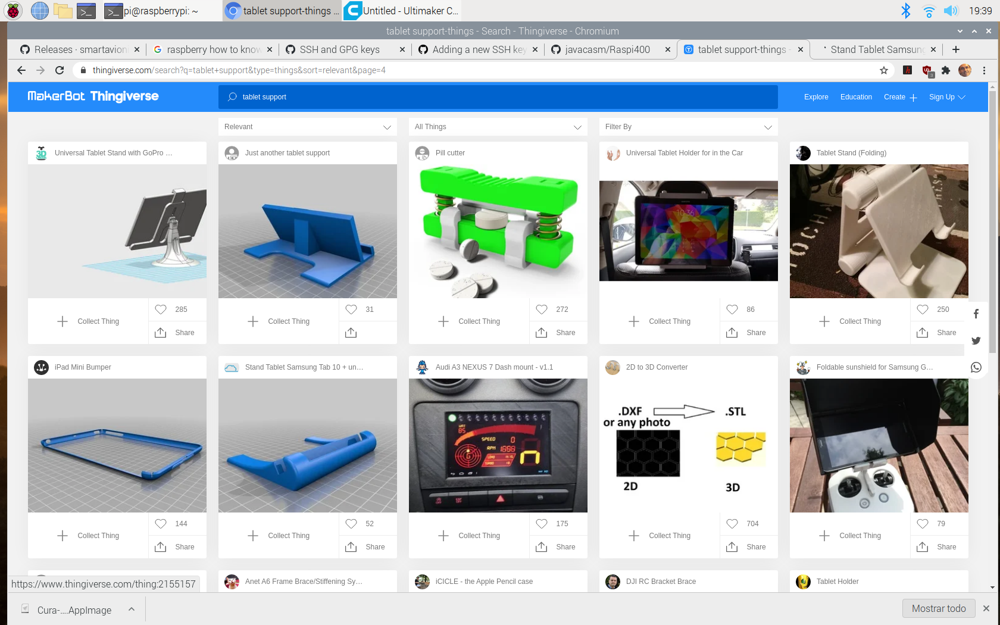


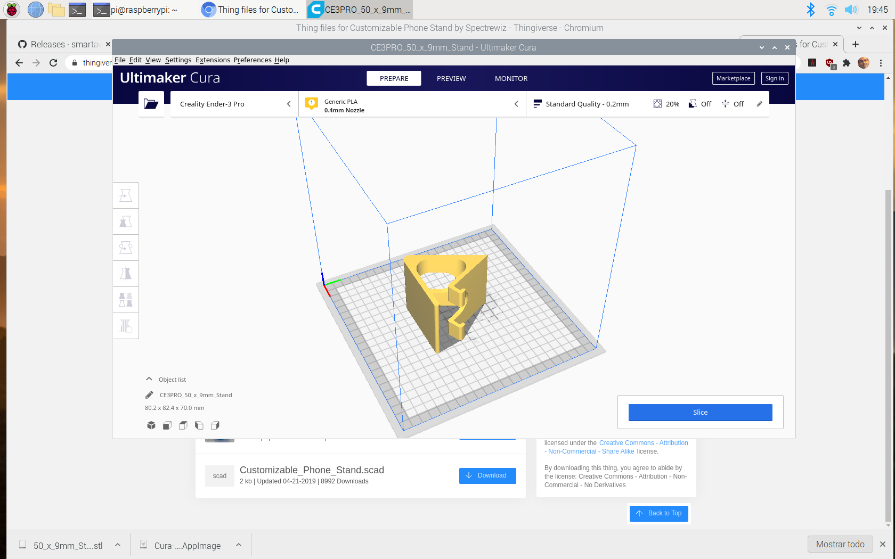

### ¿Qué es una appimage?

TODO

## Edición de video

OpenShot

```sh
sudo apt install openshot
```


## Conversor de imágenes

Imagemagick


## TODO

visual studio
micro:bit
ESP32

microfono
webcam


Ver como:
* Activar F2 para cambiar nombre
* Activar Ctrl-V para pegar en las consolas	
* ¿Recortar una imagen? Por ejemplo captura de pantalla

## OBS Studio

https://raspberrytips.com/install-obs-studio-raspberry-pi/


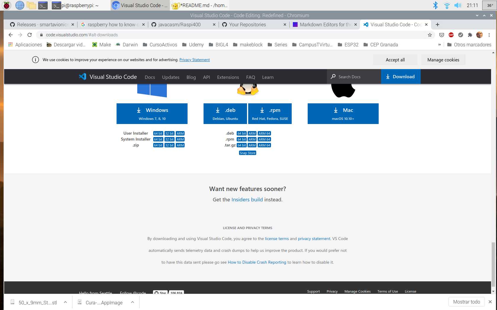


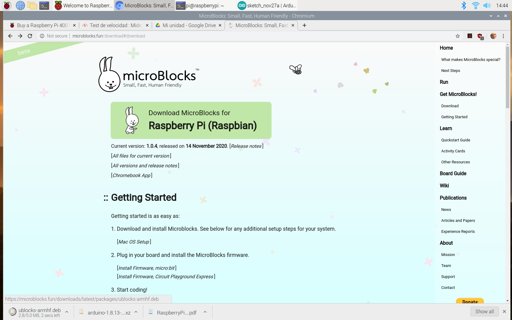


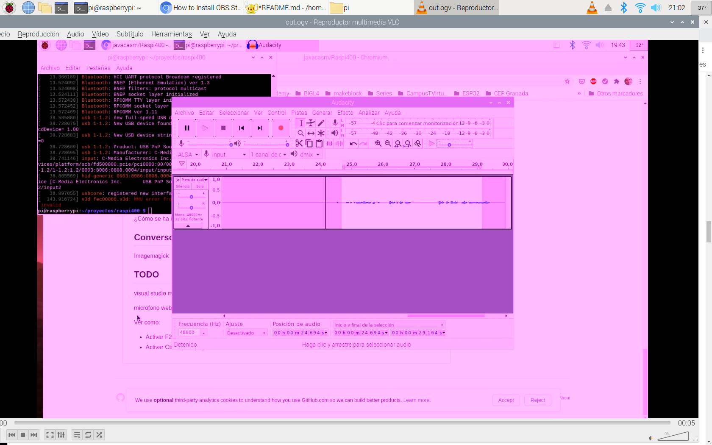
